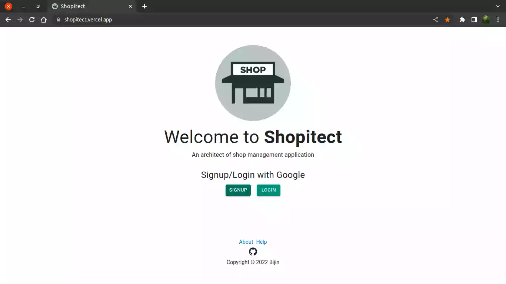
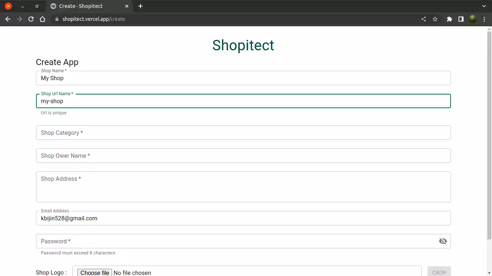
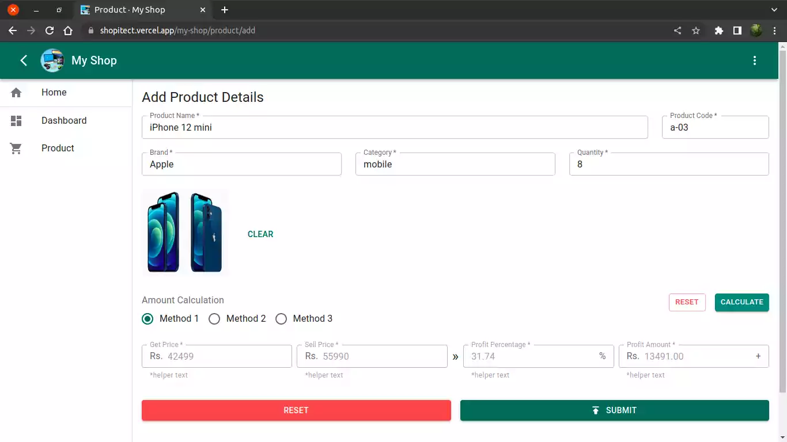
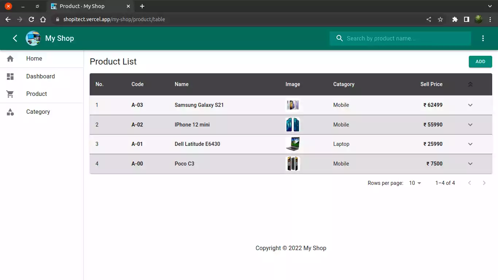
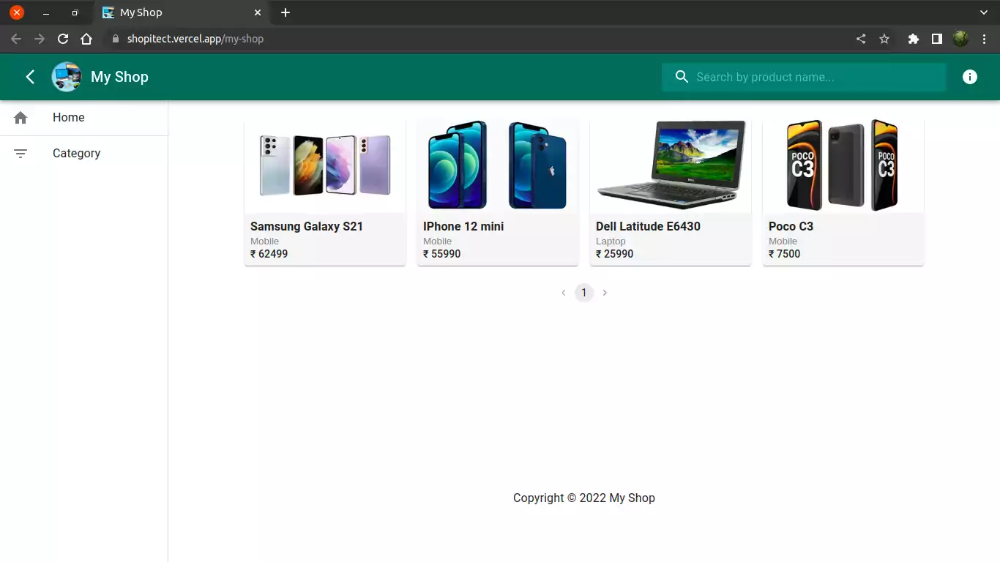

# Shopitect
### An architect of Shop Manangement Application

Shopitect is an app that generates shop management applications. Mostly useful for small-scale shops for managing their product details.

 

Anyone who has a Google account can simply create a shop app by signing into the shopitect app.
  

Each shop app has a unique URL name (Shop Url Name) that is added when creating the shop app.
###### Shop Url Name in Create page :-

 

All generated shop apps are accessible through the browser URL by using the Shop Url Name.

To access a shop app, add the Shop Url Name after the root URL(shopitect.vercel.app).
 
eg: <em><a href="https://shopitect.vercel.app/my-shop" >shopitect.vercel.app/my-shop</a></em>
 
Here 'my-shop' is the unique Shop Url Name.
 
 

Generated shop apps are simple apps that can store the details of products in the shop in a digital form.
 
###### (1) Product Add page, (2) Product Table page :-

 
 

This shop app can also use as a small e-commerce website to simply show the details of products to the shop clients.

###### Shop Home page view to shop Clints :-

 
 

Technologies used in this app :-
ReactJS, NextJS, TypeScript, Redux-Toolkit, NextAuth, Firebase, MaterialUI
